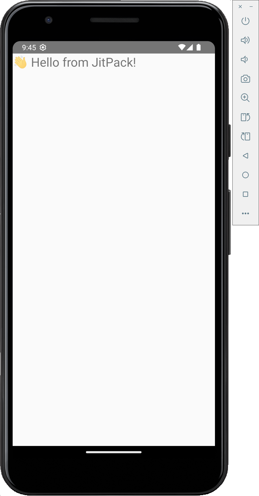

hello-world-android-app

_Last updated 14-May-2025_

## Description

A bare-bones Android app to consume the JitPack-published hello-world-android-lib library.

Here's the hello-world-android-lib repository: https://github.com/jkoutavas/hello-world-android-lib

Here's the JitPack link to the most recently published version: https://jitpack.io/#jkoutavas/hello-world-android-lib/v1.0.1

## Launching the Emulator

1. List available AVDs: `emulator -list-avds`
2. Start an AVD (replace <AVD_NAME> with your AVD name): `emulator -avd <AVD_NAME> &`

## Build and install

` ./gradlew :app:installDebug`

